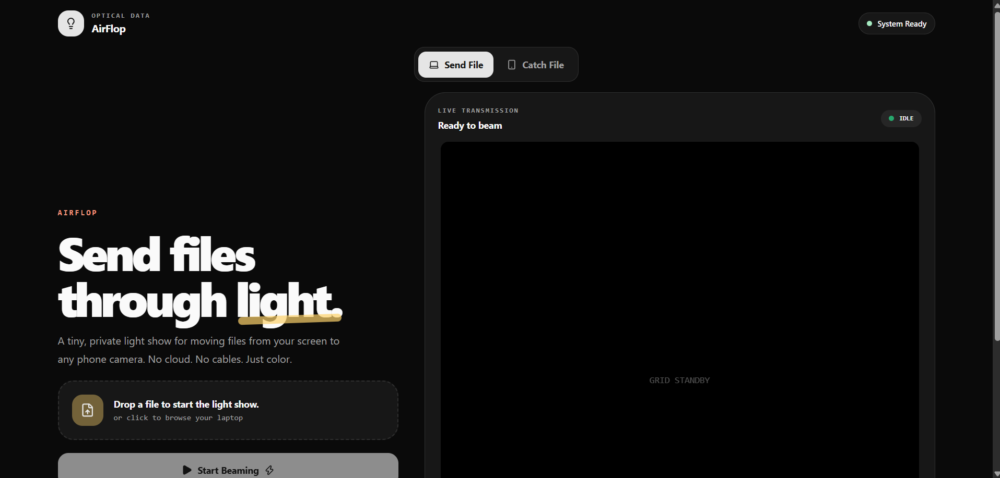
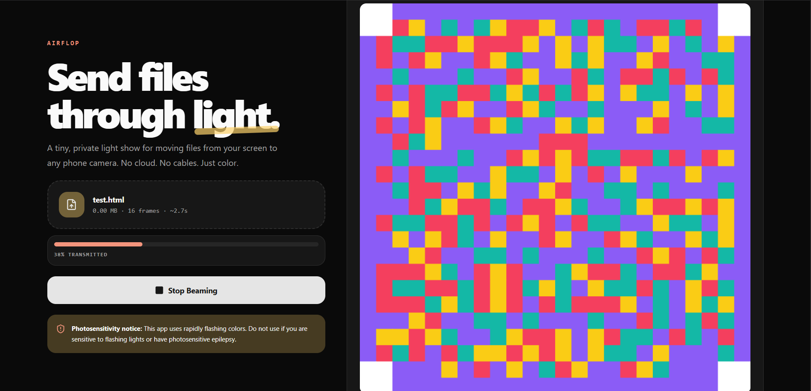
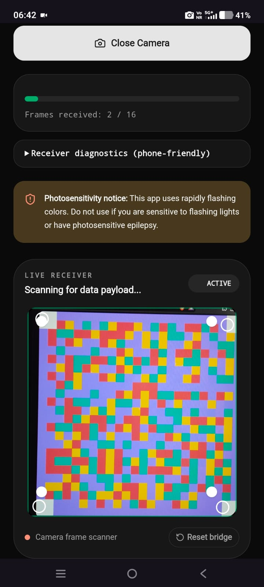
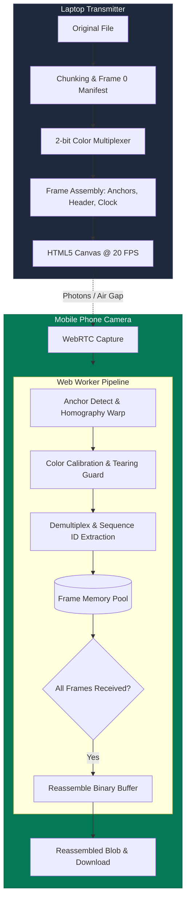

# AirFlop 🎯

## Basic Details
### Team Name: Seraphin J Raphy's Team

### Team Members
- Team Lead: Seraphin J Raphy - Government Model Engineering College

### Project Description
AirFlop is a completely ridiculous way to send files from your laptop to your phone using a violently flashing disco grid of colors. It turns your screen into a palli perunal and your phone camera into an epilepsy patient. 

### The Problem (that doesn't exist)
Cables are annoying, Bluetooth is moody, and AirDrop only works when it feels like it. Plus, sending data over Wi-Fi is just too invisible. We needed a way to send files that you can *actually see* happening in real time, preferably with enough flashing lights to wake the whole room up.

### The Solution (that nobody asked for)
We chop your file into tiny pieces, assign a color to every piece, and blast them onto your laptop screen as a 40x40 grid flashing 20 times a second. Just point your phone camera at this chaotic light show, and the app magically stitches the blinking colors back into your original file. It's wildly impractical, completely wireless, and an incredibly annoying way to move 3 KB of data.

## Technical Details
### Technologies/Components Used
For Software:
- TypeScript, HTML5, CSS
- React, Vite
- Lucide React
- Browser APIs: Canvas API, WebRTC API, Web Workers

For Hardware:
- None (pure software leveraging consumer laptop screens and smartphone cameras)

### Implementation
For Software:
# Installation
```bash
npm install
```

# Run
```bash
npm run dev
```

### Project Documentation
For Software:

# Screenshots (Add at least 3)

*Laptop transmitter view showing the 40x40 chromatic matrix, alignment anchors, and real-time transmission telemetry.*


*Mobile camera viewfinder with alignment overlay, active WebRTC stream, and chunk reception progress bar.*


*Successful client-side reassembly, integrity verification, and automatic payload download trigger.*

# Diagrams

*End-to-end data pipeline: File chunking -> Reed-Solomon parity -> 2-bit color multiplexing -> 20 FPS Canvas rendering -> WebRTC frame capture -> Web Worker perspective warp & demux -> Binary reassembly.*


### Project Demo
# Video
(https://drive.google.com/file/d/1Qrsb4kMXuVAZQvxU7ltCn2TJmRc8MJ3G/view?usp=sharing)

*Demonstration showing end-to-end optical transmission of a sample payload from laptop screen to phone camera across an air gap.*

# Live Demo
https://air-flop.vercel.app/


## Team Contributions
- Seraphin J Raphy: Sole developer. Architected the 2-bit color multiplexing pipeline, implemented the HTML5 Canvas transmitter, built the WebRTC camera capture orchestration, and developed the Web Worker decoding logic for perspective transform and binary reassembly.

---
Made with ❤️ at TinkerHub Useless Projects 


